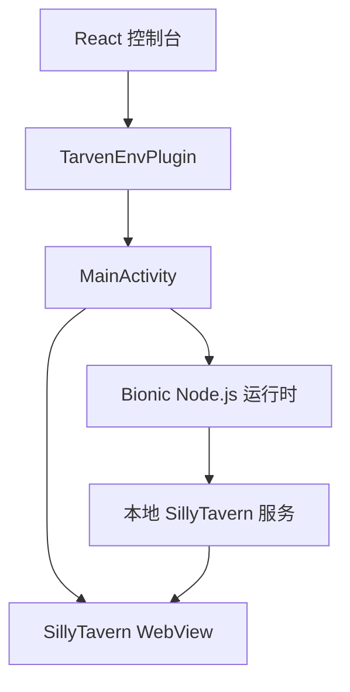

# Android 架构

Android 客户端由共享控制台、Capacitor 接口和原生运行环境三层组成。

## 职责

### React 控制台

`web/capacitor-ui/` 保存跨平台界面和 TypeScript 接口。它负责表单、状态和日志展示，不直接操作 Android 文件或进程。

### Capacitor 接口

`TarvenEnvPlugin.kt` 接收控制台调用，并通过 `progress`、`log`、`ready`、`mode` 等事件回传状态。`TarvenEnv` 是已发布接口名，修改方法和载荷时必须同步 Windows 实现与 TypeScript 声明。

### 原生宿主

`MainActivity.kt` 管理两个界面：Capacitor 控制台和 SillyTavern WebView。返回控制台不等于停止实例；停止操作必须显式结束 Node.js 进程。

### 运行时

`runtime/` 负责路径、解压、配置、进程和日志。应用只使用打包的 Bionic Node.js，不调用 Termux。所有实例 ID 在进入文件系统前都要归一化，zip 解压必须防止路径越界。

## 创建实例

1. 校验实例 ID、版本和目标端口。
2. 下载或读取 SillyTavern zip。
3. 解压到未完成目录并安装依赖。
4. 启动内置 Node.js，等待目标地址可访问。
5. 检查通过后写入实例状态；失败则停止进程并清理未完成目录。

不要提前向界面报告成功。前端看到的完成状态必须对应一个实际可启动的实例。

## 生成文件

`app/src/main/assets/public/` 来自 `web/capacitor-ui/dist/`，但为了 APK 可直接从仓库构建而提交。任何界面修改都先改源码，再运行同步脚本；不要手工修改 assets 中的哈希文件。`sillyclient-build.json` 由同步脚本生成，用来确认源码、生产构建与 APK 内资产属于同一版本。

跨仓库边界和发布决策记录在[主仓库架构文档](https://github.com/CAPTCHAAAAA/SillyClient/blob/main/docs/ARCHITECTURE.md)。
