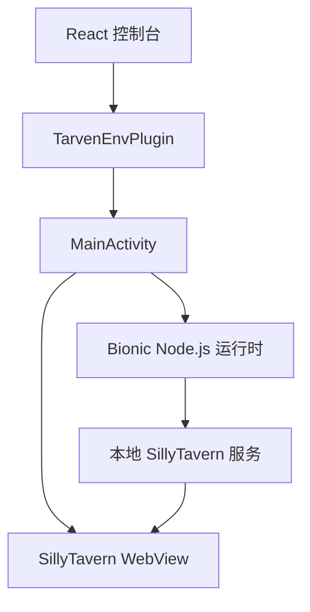

# Android 架构

Android 客户端由共享控制台、Capacitor 接口和原生运行环境三层组成。

```mermaid
flowchart TD
    UI["React 控制台"] --> Plugin["TarvenEnvPlugin"]
    Plugin --> Activity["MainActivity"]
    Activity --> Runtime["Bionic Node.js 运行时"]
    Activity --> Reader["SillyTavern WebView"]
    Runtime --> Server["本地 SillyTavern 服务"]
    Server --> Reader
```

## 职责

### React 控制台

本仓库 `web/capacitor-ui/` 保存 Android 适配后的跨平台界面和 TypeScript 接口源码。它负责表单、状态和日志展示，不直接操作 Android 文件或进程。

### Capacitor 接口

`TarvenEnvPlugin.kt` 接收控制台调用，并通过 `progress`、`log`、`ready`、`mode` 等事件回传状态。`TarvenEnv` 是已发布接口名，修改方法和载荷时必须同步 Windows 实现与 TypeScript 声明。

### 原生宿主

`MainActivity.kt` 管理两个界面：Capacitor 控制台和 SillyTavern WebView。返回控制台不等于停止实例；停止操作必须显式结束 Node.js 进程。

### 系统浏览器与导航归属

项目、扩展和更新页面通过 `TarvenEnv.openExternalUrl({ url })` 打开系统浏览器，
不受酒馆 `contentOpenMode` 影响。`ExternalNavigationPolicy` 只接受有主机、没有内嵌
凭据的绝对 HTTP(S) 地址；任意其他协议、空 user-info、非法端口及地址中的控制字符、
空白或反斜杠均拒绝。没有显式实例身份的旧 `enterImmersive({ url })` 调用在改变
当前酒馆或读取认证前外发，不能将项目地址当成运行实例。

酒馆 WebView 只分类顶层导航：同源路径和有效端口相同的地址仍在应用内，
跨源 HTTP(S) 地址外发；同源 `blob:` 保留既有下载通道，异源或不安全 blob 阻止。
子框架、API、图片、其他子资源、下载实现和静态网关不因外链功能改变。
`ExternalPopupHandler` 只为用户手势新窗口创建短期接收器，最多四个、十秒超时；
接收器零尺寸、不可见、不获焦点、不进入无障碍交互树，没有 JavaScript 或原生桥，
并阻止网络加载。普通 HTTP(S) 新窗口外发，下载沿用原通道，目标解析、关闭、超时
或 Activity 销毁都会移除并销毁接收器，过期实例回调不能外发。

Android `shouldOverrideUrlLoading` 不覆盖任意 POST 导航或应用主动 `loadUrl`；
显式应用入口单独校验，但不能把任意跨源 POST 表单称为已拦截。系统浏览器选择、
真实 WebView 的新窗口回调次序和下载行为仍须授权后实机验收，不以纯策略单测代替。

### 远程连接认证

远程实例可以配置 HTTP Basic Auth。React 控制台只保存“已配置”状态和用户名，不保存密码；密码由 `RemoteBasicAuthStore` 使用 Android Keystore 中的 AES/GCM 密钥加密后写入应用私有存储。`pingUrl` 先在原生层验证连接，认证头只会发送给初始地址及其同源重定向；`MainActivity` 仅在目标主机发起 WebView 认证挑战时提交对应凭据。

删除远程实例会同步删除安全存储中的凭据。连接地址、日志和 `localStorage` 不得包含密码；公网地址应优先使用 HTTPS，Basic Auth 本身不提供传输加密。

### 运行时

本轮运行时收敛：`BundledRuntime` 在应用打开时异步准备共享 Bionic Node/npm/原生库，
按 APK 安装修订记录完成状态，同目录初始化跨 Activity 串行。它不启动用户实例，
也不保留一个混用多个酒馆状态的常驻 Node 进程。`RuntimeConfiguration.serverBuilder`
在酒馆自己的 Node 进程内先解析 YAML 再加载 `server.js`，不再额外拉起配置进程，
不改写上游 `open` 依赖；配置值未变化时不重写文件。

`DependencyInstaller` 使用内置 Node、共享 npm 完整性缓存和实例自身清单安装，
不复用任意另一个实例的 `node_modules`。外部存储安装禁用 npm bin 链接，
生命周期命令的 Node 入口仍明确指向内置二进制。网络失败切换 npmmirror/官方源，
超时先确认旧进程退出，不能同时启动两个依赖写入者。

`TavernReleaseCatalog` 独立处理版本元数据、已验证缓存和明确标注的稳定分支兜底；
`SourceDownloader` 独立负责公共 SillyTavern 官方归档与 HTTPS 镜像，限制来源、
重定向、体积、超时和取消。第三方镜像不构成上游真实性签名。
`SourceArchive` 先读 ZIP 中央目录，再单次流式解压并检查 CRC、路径和展开大小。

`storage/InstanceDocumentsProvider` 通过系统 SAF 显式提供标准用户数据的只读浏览/导出。
文档句柄是私有 SQLite 中的随机 ID，重新校验实例身份与路径，拒绝链接、凭据与非只读模式；
它不开放原生配置、扩展代码或 `node_modules`，也不保证所有文件管理器能访问 Android/data。

`runtime/` 负责路径、解压、配置、进程和日志。应用只使用打包的 Bionic Node.js，不调用 Termux。所有实例 ID 在进入文件系统前都要归一化，zip 解压必须防止路径越界。

`app/src/main/assets/bootstrap/rootfs/` 中的两个压缩包提供 npm 与 Bionic 共享库，`app/src/main/jniLibs/arm64-v8a/libtarven-node.so` 是 Node.js 可执行入口。它们虽然是大文件，但都是 APK 的直接构建输入；更新时必须同时记录来源、架构、校验和与实机结果。

### 后端职责与取消

`OperationCoordinator` 串行执行启动、迁移和卸载，每个任务有 `instanceId`、`operationId`。
停止会立即取消当前代际及其 I/O/进程，旧任务不能继续启动或发布状态；传入旧任务的标识不能停止新的任务。
`ProcessSupervisor` 只管理本宿主创建的进程，退出等待在后台执行；命令超时监督与输出读取并行。
`log`、`progress`、`ready`、`error`、`mode` 在有任务上下文时携带对应标识；
`getStatus` 仅在实际就绪时返回当前实例，运行操作标识必须对应仍存活的本地进程。

`InstanceRepository` 扫描只读取元数据，详情大小在插件后台计算并短期缓存，排除
`node_modules`、`.git`、`.cache`；删除不为容量数字预扫描整棵依赖树，未知释放容量返回零。
`LogService` 对日志输出、单行长度和尾部读取设上限，服务与 npm 日志只保留当前文件及一个轮转文件。
`NativeTreeRemoval` 对归属已验证的直接子路径调用原生删除，按实际输出进展监督闲置，
不以总耗时 60 秒杀掉仍在工作的进程。每文件输出仅用于计数，公开诊断不含路径；
退出状态和物理残留才决定成功。`InstanceRemoval` 仍在最后删除身份与解除登记。
新安装回滚共用原生删除，宿主暂存归属标记保留到内容移除后，避免 JVM 再逐文件遍历。
补依赖前记录宿主自有未完成标记，成功后才移除；取消或 npm 失败后即使存在半成品
`node_modules`，后续启动仍会重试，不替换已有源码和数据。

`CleanupService` 不将实例目录列为垃圾，也不删除缓存或日志的整个根目录。
封面只有收到明确的 `activeCoverPaths` 快照时才参与判断，仍保护已有原生实例及 `activeInstanceIds`；
省略或不能解析快照时全部保留。清理只返回超过保护期的非活动文件，每个文件带五分钟有效的单次令牌。
删除必须重新验证令牌、文件状态、活动任务以及规范路径，不跟随符号链接，不以失败删除报告成功。

### 迁移边界

新建实例优先使用应用外部 `instances/` 根目录，目录名来自经过清洗的初始显示名称，
重名追加稳定 ID 摘要。不可变实例 ID 与物理名称分离；已登记位置、旧私有目录和用户
明确选定且有权限的原生路径继续验证归属，不通过启动参数静默搬迁。
SAF 目录树和 ZIP 只作为迁移来源，不能把 content URI 当成 Node 可执行路径。
新安装与复制迁移只在目标同级暂存，全部复制与依赖验证通过后才原子提交，无跨卷移动
失败后的复制兜底。现有非空目标不能覆盖；原地接管仍明确拒绝。
既有实例同 ID 的跨卷迁出仍需独立事务实现，本轮不自动移动或删除旧实例。

### 可选预制安装

`provisionAndStart`、`migrateInstance` 的可选 `preinstall` 载荷只接受
`{ revision: 1, extensionIds: [...] }`。主题沿用 `companionPreset`，与扩展选择独立。
安装清单 `app/src/main/assets/preinstalled-extensions/catalog.json` 只包含来源、固定提交、
SHA-256、字节数和许可证元数据，不包含第三方源码；扩展仅在用户选择后下载到用户实例。
允许的来源固定为酒馆助手、小白 X、提示词模板和官方骰子扩展，不能提供任意下载 URL。

`PreinstalledExtensionInstaller` 从 GitHub codeload 下载固定提交，校验完整压缩包后保留
上游已编译入口、文档与许可证。拒绝重定向、符号链接、越界/重复路径、加密压缩包，
并限制压缩包 32 MiB、解压 128 MiB、单文件 32 MiB 和 8192 个条目。
全部所选扩展校验成功后才发布至 `data/default-user/extensions/`。
已有有效扩展不覆盖，也不修改用户的禁用设置；取消或启动失败只回滚本次新建且内容、
目录身份和归属标记均未变化的扩展。扩展脚本不会在安装器中执行。

`RuntimeConfiguration` 使用实例已安装的 `yaml` 解析器及内置 Bionic Node.js，
拒绝非法、非映射 YAML，保留注释、未知字段及既有安全配置，只原子更新宿主管理的键。
主题或扩展写入前确认 `dataRoot` 指向该实例标准 `data/`；自定义数据根明确拒绝，
不能把预制内容写入错误位置。解析器缺失或失败时保留原配置并中止操作。

## 创建实例

1. 校验实例 ID、版本和目标端口。
2. 下载或读取 SillyTavern zip。
3. 新安装解压到独立暂存目录并安装依赖，成功后提交至实例目录；已有源码缺依赖时原地补齐。
4. 启动内置 Node.js，等待目标地址可访问。
5. 检查通过后写入实例状态；失败则停止进程并仅清理本任务的暂存目录，保留已有实例与用户数据。

不要提前向界面报告成功。前端看到的完成状态必须对应一个实际可启动的实例。

## 生成文件

`app/src/main/assets/public/` 来自本仓库 `web/capacitor-ui/dist/`，但为了 APK 可直接从仓库构建而提交。任何界面修改都先改本仓库源码，再运行同步脚本；不要手工修改 assets 中的哈希文件。`sillyclient-build.json` 由同步脚本生成，用来确认源码、生产构建与 APK 内资产属于同一版本。

跨仓库边界和发布决策记录在[主仓库架构文档](https://github.com/CAPTCHAAAAA/SillyClient/blob/main/docs/ARCHITECTURE.md)。
